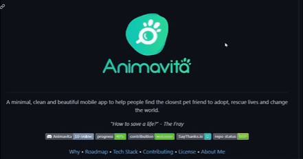

# Projeto com README
um projeto de tesste com um aquirvo README ✔🙌

[]

## Tecnologias utilizadas
- HTML
- CSS
- JS

## Como utilizar

1 - clone pro projeto
```
git clone <url>
```
2 - Acesse a pas do prjeto 
```
cd repositorio-com-readme
```


